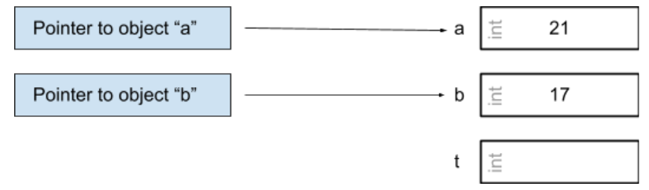
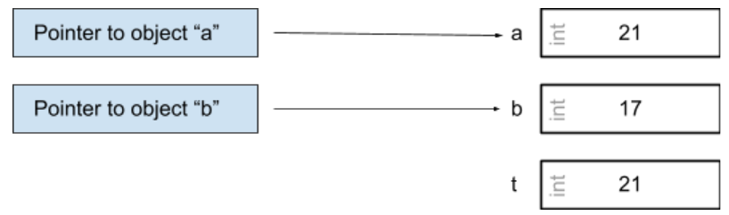
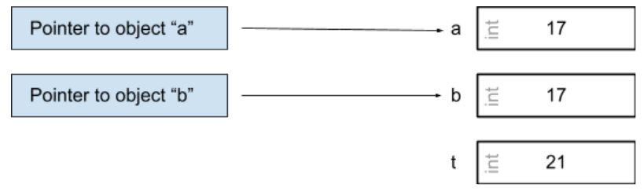
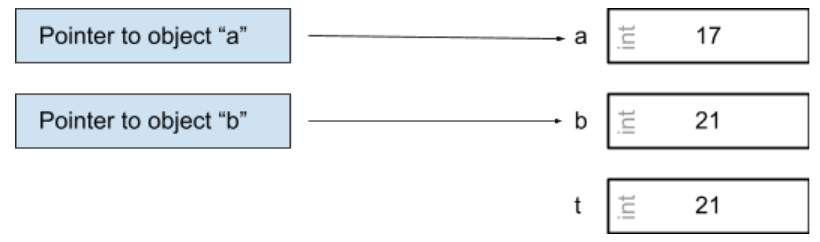

# Chapter 2: Objects, Functions, and Types

Every type in C is either:
  * an **OBJECT** type
  * a **FUNCTION** type

<br /> 

> An object is storage in which you can represent values. Defined by the C Standard as a "region of data storage in the execution environment, the contents of which can represent values"

<br /> 

Variables are objects, and in C are typed. Here's an example of declaring a variable:

```
int a = 1;
printf(“%s”, a); 
```

>`` >> 1 ``

Functions are *not* objects but do have ytpes. A function type is characterized by BOTH 
  * its return type as well as 
  * the number and types of its *parameters*. 

Finally the C language also has *pointers*, which can be though of as an address -- a location in memory where an object or function is stored. A pointer type is derived from a function or object type, called the *referenced* type.  A pointer derived from the referenced type "T" is called a *pointer* to "T". 

Because objects and functions are different things, object pointers and function pointers are also different things.

---

```
int a = 1 
```
``"a"`` is an integer object of value 1


```
int *a 
```
``Pointer to "a"`` ⇒ A Pointer to ``a`` in Memory


```
&a
```
“``The Address of "a"``” ⇒ Where ``“a”`` *lives* in Memory


<br />

### A simple "swap" program:

<br />

```
#include <stdio.h>
#include <stdlib.h>
 
void swap(int a, int b) {
 int t = a;
 a = b;
 b = t;
 printf("swap: a: %d, b: %d \n", a,b);
}
 
int main(void) {
 int a = 21;
 int b = 17;
 
 swap(a,b);
 printf("main: a: %d, b: %d \n", a, b);
}

```

Prints: 
>``>> swap: a: 17, b: 21``

>``>> main: a: 21, b: 17``

* Q: Why do the values of a and b within `main` not change? 
* A: C does not perform in-place changes in memory in this manner when the values are called in another function. **“C is a call-by-value (also called a pass-by-value) language, which means that when you provide an argument to a function, the value of that argument is copied into a distinct variable for use within the function.”**

<br />

How we would have to do it:

```
int main(void) {
 int a = 21;
 int b = 17;
 
 printf("main: a: %d, b: %d \n", a, b);
 
 int t = a;
 a = b;
 b = t;
 printf("swap: a: %d, b: %d \n", a,b);
}

```
<br />

Buuuuut, what if we did want to do this in another function? This is where C is powerful with its usage of pointers.

> “This approach simulates call-by-reference (also known as pass-by-reference) by generating object addresses, passing those by value, and then dereferencing the copied addresses to access the original objects.”

First we need to modify our function call. We don’t want to pass the values of the objects “a” and “b”, **but rather pointers to these objects**. We can generate pointers using `&`.

```
int main(void) {
 int a = 21;
 int b = 17;
 
 swap(&a, &b);
 printf("main: a: %d, b: %d \n", a, b);
}

```

> The unary “&” is the address-of operator, which generates a pointer to its operand. **This change is necessary because the swap function now accepts pointers to objects of type int as parameters instead of simply values of type int**

Then we should adjust *our parameters* in the swap function from values to pointers.

```
void swap(int *pa, int *pb) {
 printf("%p \n", pa);
 printf("%p \n", pb);
}
```

To recap, thus far we have:

```
void swap(int *pa, int *pb) {
 printf("a: %p \n", pa);
 printf("b: %p \n", pb);
}
 
int main(void) {
 int a = 21;
 int b = 17;
 
 swap(&a, &b);
 printf("main: a: %d, b: %d \n", a, b);
}

```

Running this program results in:

> a: 0x7ffeebb8622c

> b: 0x7ffeebb86228

> main: a: 21, b: 17


*Now how can we use pointers to execute the swap?* 

1. Initialize a temporary variable.

```
int t;
```



Save ``the value of the pointer to “a”`` in the temporary variable.

```
t = *pa;
```



(we can combine this into one line:) 

```
int t = *pa;
```

2. Step 2: Overwrite ``the value of pointer a`` to be ``the value of pointer b``
```
*pa = *pb
```



3. Step 3: Overwrite ``the value of pointer b`` to be ``the value of t``
```
*pb = t
```



In full:

```
void swap(int *pa, int *pb) {
 int t;
 t = *pa;
 *pa = *pb;
 *pb = t;
}
 
int main(void) {
 int a = 21;
 int b = 17;
 
 printf("main pre-swap: a: %d, b: %d \n", a, b);
 swap(&a, &b);
 printf("main post-swap: a: %d, b: %d \n", a, b);
}

```
<br />

Results in:

> main pre-swap: a: 21, b: 17

> main post-swap: a: 17, b: 21

[Great recap here going over the nuances.](https://youtu.be/rtgwvkaYt1A).


