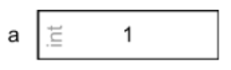
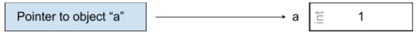

# Chapter 2: Objects, Functions, and Types

Every type in C is either:
  * an **OBJECT** type
  * a **FUNCTION** type

<br /> 

> An object is storage in which you can represent values. Defined by the C Standard as a "region of data storage in the execution environment, the contents of which can represent values"

<br /> 

Variables are objects, and in C are typed. Here's an example of declaring a variable:

```
int a = 1;
printf(“%s”, a); 
```

>`` >> 1 ``

Functions are *not* objects but do have ytpes. A function type is characterized by BOTH 
  * its return type as well as 
  * the number and types of its *parameters*. 

Finally the C language also has *pointers*, which can be though of as an address -- a location in memory where an object or function is stored. A pointer type is derived from a function or object type, called the *referenced* type.  A pointer derived from the referenced type "T" is called a *pointer* to "T". 

Because objects and functions are different things, object pointers and function pointers are also different things.

---

```
int a = 1 
```
``"a"`` is an integer object of value 1



```
int *a 
```
``Pointer to "a"`` ⇒ A Pointer to ``a`` in Memory



```
&a
```
“``The Address of "a"``” ⇒ Where ``“a”`` *lives* in Memory


